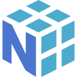
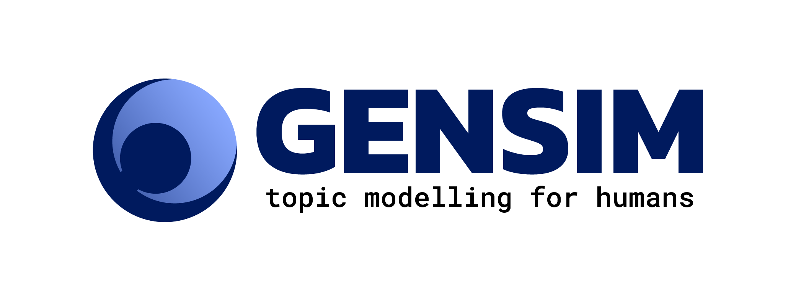
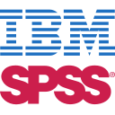
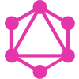
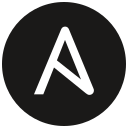
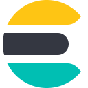

<h1 align="center">Hey, I'm Arefin 👋</h1>
 

  <i>Started as a media and journalism graduate who somehow wandered into epidemiology, stayed for the math, and now builds software and writes national policy.</i>

---
 
### About me
 
I started out in newsrooms and somehow ended up modeling cholera outbreaks, then drafting the policies I now have to live under. The throughline is simpler than the CV makes it look: take a messy real-world problem, find the signal in it, and build something that holds up under scrutiny, whether that something is a statistical model, a policy, or a piece of production software.

I work across research, policy, and engineering.

- 🏛️ Data & Research Consultant at **a2i** (ICT Division), focused on digital public infrastructure, interoperability, and digital governance
- 🛠️ Founder of **[Verne](https://vernesystems.com)**, a forward deployed engineering company
- ⚙️ Forward Deployed Engineer at **[Ophanix](https://ophanix.org)**, where I built the Ophanix Control Panel
- 📊 Quantitative researcher across political science, public health, and food systems
- ✍️ I draft national policy, publish research, and write on system design

---

### Things I've done
 
**Policy.** I've helped author some of Bangladesh's core digital policy: lead drafter of the **National Startup Policy**, committee member on the **National AI Policy**, drafter of the **National Blockchain and Cloud Policy**, and co-author of the **National Digital Transformation Strategy**.
 
**Research.** Years of quantitative work across fields that rarely share a CV: predicting cholera outbreaks, detecting heat stress in urban slums, modeling food systems with general-equilibrium methods, and tracking conflict across 23 districts. Different domains, same craft, which is to respect the uncertainty and never report a number you can't defend.
 
**Funding.** I've written grants and helped raise research money from the institutions that pay for this kind of work, including the **Wellcome Trust, NIH, the Gates Foundation, and Bloomberg**.
 
**Words.** Peer-reviewed publications (collected on [ORCID](https://orcid.org/0009-0002-4551-6572)), opinion columns in the national press, and long technical write-ups on system design.
 

### Policy & Strategy

National policies and strategies I have helped author or draft:

- Lead Drafter, **National Startup Policy of Bangladesh**
- Committee Member, **National AI Policy of Bangladesh**
- Drafter, **National Blockchain and Cloud Policy**
- Co-Author, **National Digital Transformation Strategy**
- Co-Author, **Posts and Telecommunications Division Transformation Strategy 2025–30**

---

### Research

Quantitative and computational work spanning several fields:

- **Public health:** predictive models for cholera early warning, heat stress detection, effective coverage analysis
- **Food systems:** spatial microsimulation, computable general equilibrium modeling, nutrition-sensitive policy
- **Political science:** conflict analytics, peace and violence datasets, genocide studies
- **Computational social science:** NLP on million-document corpora, semantic network analysis of patents

📄 Publications on [ORCID](https://orcid.org/0009-0002-4551-6572)

---

 
### What I'm working on right now
 
- 🗳️ **Latent-Markov turnout models** — treating "I'll probably vote" as a hidden state that drifts between survey day and election day, so a poll becomes an honest range instead of a falsely precise number.
- 📝 **Rich-text versioning** — Git-style branching, diffing, and merging for documents, built on Merkle trees and CRDTs instead of line-by-line text diffs.
- 🧠 **Geometric deep learning** — neural networks for data whose shape carries meaning: graphs, meshes, and other structured objects.

---
 
### Tech Stack

Tools I reach for regularly, grouped by domain. Click an icon to open its docs.

<b>Languages</b>

 
<table>
  <tr>
    <td align="center" width="88"> <b>Python</b></td>
    <td align="center" width="88"> <b>R</b></td>
    <td align="center" width="88"> <b>SQL</b></td>
    <td align="center" width="88"> <b>JavaScript</b></td>
    <td align="center" width="88"> <b>TypeScript</b></td>
  </tr>
  <tr>
    <td align="center" width="88"> <b>C++</b></td>
    <td align="center" width="88"> <b>MATLAB</b></td>
    <td align="center" width="88"> <b>PHP</b></td>
    <td align="center" width="88"> <b>LaTeX</b></td>
    <td align="center" width="88"> <b>Bash</b></td>
  </tr>
  <tr>
    <td align="center" width="88"> <b>Go</b></td>
    <td align="center" width="88"> <b>Julia</b></td>
    <td align="center" width="88"> <b>Rust</b></td>
  </tr>
</table>

<b>Machine Learning, Deep Learning & NLP</b>

 
<table>
  <tr>
    <td align="center" width="88"> <b>PyTorch</b></td>
    <td align="center" width="88"> <b>TensorFlow</b></td>
    <td align="center" width="88"> <b>scikit-learn</b></td>
    <td align="center" width="88"> <b>Pandas</b></td>
    <td align="center" width="88"> <b>NumPy</b></td>
  </tr>
  <tr>
    <td align="center" width="88"> <b>SciPy</b></td>
    <td align="center" width="88"> <b>Gensim</b></td>
    <td align="center" width="88"> <b>Hugging Face</b></td>
    <td align="center" width="88"> <b>LangChain</b></td>
    <td align="center" width="88"> <b>Streamlit</b></td>
  </tr>
  <tr>
    <td align="center" width="88"> <b>PyTorch3D</b></td>
    <td align="center" width="88"> <b>LangGraph</b></td>
  </tr>
</table>

<b>Statistics & Simulation</b>

 
<table>
  <tr>
    <td align="center" width="88"> <b>SPSS</b></td>
    <td align="center" width="88"> <b>Stata</b></td>
    <td align="center" width="88"> <b>Wolfram</b></td>
    <td align="center" width="88"> <b>Jupyter</b></td>
  </tr>
</table>

<b>Data Visualization</b>

 
<table>
  <tr>
    <td align="center" width="88"> <b>Power BI</b></td>
    <td align="center" width="88"> <b>Tableau</b></td>
    <td align="center" width="88"> <b>Plotly</b></td>
    <td align="center" width="88"> <b>D3.js</b></td>
    <td align="center" width="88"> <b>matplotlib</b></td>
  </tr>
</table>

<b>Web & Backend</b>

 
<table>
  <tr>
    <td align="center" width="88"> <b>Next.js</b></td>
    <td align="center" width="88"> <b>React</b></td>
    <td align="center" width="88"> <b>FastAPI</b></td>
    <td align="center" width="88"> <b>Node.js</b></td>
    <td align="center" width="88"> <b>GraphQL</b></td>
  </tr>
  <tr>
    <td align="center" width="88"> <b>Tailwind</b></td>
    <td align="center" width="88"> <b>Supabase</b></td>
    <td align="center" width="88"> <b>Django</b></td>
  </tr>
</table>

<b>DevOps & Cloud</b>

 
<table>
  <tr>
    <td align="center" width="88"> <b>Docker</b></td>
    <td align="center" width="88"> <b>Kubernetes</b></td>
    <td align="center" width="88"> <b>GitHub Actions</b></td>
    <td align="center" width="88"> <b>Terraform</b></td>
    <td align="center" width="88"> <b>Ansible</b></td>
  </tr>
  <tr>
    <td align="center" width="88"> <b>Google Cloud</b></td>
    <td align="center" width="88"> <b>AWS</b></td>
    <td align="center" width="88"> <b>Azure</b></td>
    <td align="center" width="88"> <b>Grafana</b></td>
  </tr>
</table>

<b>MLOps & DataOps</b>

 
<table>
  <tr>
    <td align="center" width="88"> <b>MLflow</b></td>
    <td align="center" width="88"> <b>W&amp;B</b></td>
    <td align="center" width="88"> <b>Airflow</b></td>
    <td align="center" width="88"> <b>Spark</b></td>
    <td align="center" width="88"> <b>Kafka</b></td>
  </tr>
</table>

<b>Databases & Research Tools</b>

 
<table>
  <tr>
    <td align="center" width="88"> <b>MySQL</b></td>
    <td align="center" width="88"> <b>PostgreSQL</b></td>
    <td align="center" width="88"> <b>MongoDB</b></td>
    <td align="center" width="88"> <b>Redis</b></td>
    <td align="center" width="88"> <b>Git</b></td>
  </tr>
  <tr>
    <td align="center" width="88"> <b>Elasticsearch</b></td>
    <td align="center" width="88"> <b>Neo4j</b></td>
    <td align="center" width="88"> <b>MAXQDA</b></td>
    <td align="center" width="88"> <b>KoboToolbox</b></td>
    <td align="center" width="88"> <b>NVivo</b></td>
  </tr>
</table>

 
---
 
### Writing
 
I publish notes on system design and write summaries of the papers I'm reading.

- 📝 [Research Paper Blog](https://thedotproductblog.vercel.app/) <!-- replace with your blog URL -->

---

### Connect

